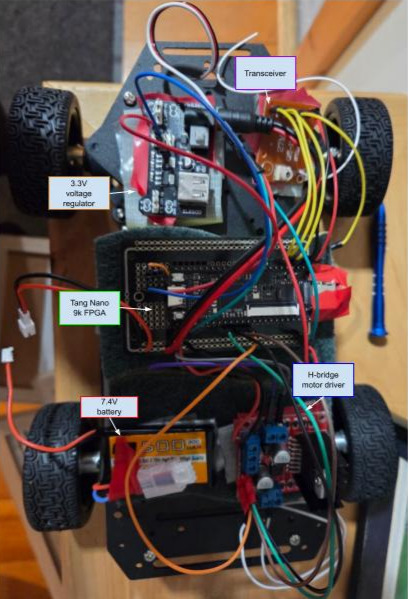

## FPGA-RC-car
Creating an RC car with an FPGA, more specifically the Tang Nano 9K. I made this project to have something that I could show to other people that's kind of cool.

I used a perfboard with a 7.4V battery to make the RC car more permanent and portable.

The main problems with the project were the electronics I got outside of the FPGA. For instance, the 3.3V buck module fried itself, and the driver modules and transmitter all broke from general use, which was a pain. However, I simply bought more reliable and expensive electronics, which fixed the issue pretty quickly.

The code for the project is pretty simple. I take the input from the receiver and use it to either output the correct PWM signal to the servo if the input is left/right, or output the PWM signal and direction for the motor if the input is forward/backward.
# Picture of wiring of the car

# Video of the car working
